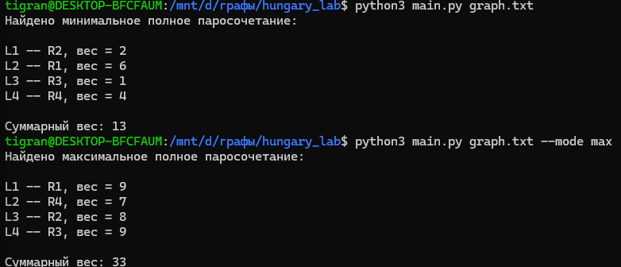

# Венгерский алгоритм

Задание 4, вариант а). Программа находит минимальное или максимальное по весу полное паросочетание в двудольном графе.

Нужен Python 3.9 или новее. Сторонние библиотеки не требуются.

## Файлы

- `main.py` — программа.
- `graph.txt` — граф с четырьмя вершинами в каждой доле. Минимальный вес — 13, максимальный — 33.
- `graph_sparse.txt` — граф с отсутствующими рёбрами. Минимальный вес — 6, максимальный — 15.
- `graph_impossible.txt` — граф с равными долями, в котором полного паросочетания нет.
- `graph_unequal.txt` — граф с разными размерами долей, полного паросочетания нет.
- `result.png` — скриншот работы программы.
- `README.md` — описание и инструкция.

## Запуск

Команды выполняются из папки с программой.

Минимальный вес:

```bash
python3 main.py graph.txt
```

Максимальный вес:

```bash
python3 main.py graph.txt --mode max
```

Пример с отсутствующими рёбрами:

```bash
python3 main.py graph_sparse.txt
```

Примеры, в которых полного паросочетания нет:

```bash
python3 main.py graph_impossible.txt
python3 main.py graph_unequal.txt
```

## Входные данные

Первая строка — число вершин в каждой доле `n` или два числа `n m`, задающие размеры долей. Далее записывается матрица: `n` строк по `m` элементов. Если указано только `n`, то `m = n`.

Строки соответствуют левой доле, столбцы — правой. Целое число обозначает вес ребра, `x` — отсутствие ребра. Нулевые и отрицательные веса допускаются.

```text
3
4 x 1
2 5 x
x 3 6
```

## Результат

Программа выводит выбранные пары вершин и суммарный вес. Если полного паросочетания нет, выводится соответствующее сообщение.

Для графа из `graph.txt` минимальный вес — 13, максимальный — 33.

